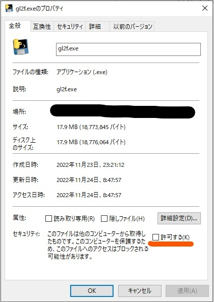

# GL2 familiar cli

[GL2 family ファンクラブサイト](https://girls2-fc.jp/) をターミナルから閲覧する非公式アプリです。
公式サイトではメンバーごとのリストが用意されていなかったり複数の記事を開くのが大変だったり使いづらかったので作りました。
ブラウザで開くとき以上のやりとりをしていないので大丈夫と思っていますが、このアプリは[利用規約](https://girls2-fc.jp/page/term)に触れる行為を目的とはしていませんので、問題があるかもしれない部分を見つけたら教えてくださると助かります。


> **Note**
> 短縮されたコマンド `gl2b gl2r gl2n gl2d` を削除しました。
> かわりに bash の補完を提供しコマンドの入力を簡単にしました。
> また、[ページの指定方法](./docs/boards.md)が変更され、 `blogs/momoka` のように `/` で区切るようになりました。


## 機能

ファンクラブの様々な記事について、以下のようなコマンドで操作ができるようになります。

* [gl2f cat](./docs/commands.md#gl2f-cat-ターミナルで本文を読む) ターミナル上に本文を表示する
* [gl2f dl](./docs/commands.md#gl2f-dl-記事に含まれる画像や動画をダウンロードする) 記事に含まれる画像や動画をダウンロードする
* [gl2f ls](./docs/commands.md#gl2f-ls-記事の情報をリストする) 一覧表示する
* [gl2f open](./docs/commands.md#gl2f-open-記事をブラウザで開く) ページを一括でブラウザで開く
* [gl2f search](./docs/commands.md#gl2f-search-記事の内容を検索する) 記事内容を検索する

対象となるページは

* [today](./docs/boards.md#today-24時間以内の更新) 24時間以内の更新
* [blogs](./docs/boards.md#blogs-日記) 日記
* [news](./docs/boards.md#news-ニュース) ニュース
* [radio](./docs/boards.md#radio-ラジオ) ラジオ
* [gtube](./docs/boards.md#gtube-Gtube) Gtube
* [cm](./docs/boards.md#cm-commercial-movie) commercial movie
* [その他過去のページ](./docs/other_boards.md)

です。


また[アドオン](./docs/addon.md) によりコマンドを追加することができます。


## 必要なもの

* ターミナル (必須ではありませんが、以下の機能があると使いやすくなります)
	* 全角文字や絵文字の表示
	* 256 color
	* url を開いてくれる
	* sixel による画像表示
* [libsixel](https://github.com/saitoha/libsixel) (ターミナル上に画像を表示するため, 無くても他の機能は動作します)


## インストール

二つのインストール方法があります。

### 1. pip を使う

Python3.8 or later と pip の環境があれば [PyPI](https://pypi.org/project/gl2f/) に公開されているパッケージからインストールできます。

```sh
pip install gl2f
```

### 2. 実行ファイルをダウンロードする

Windows と MacOS では、ダウンロードしてすぐ使えるアプリケーションをリリースしています。

https://github.com/trnciii/gl2f-cli/releases

いま配布しているアプリケーションには署名ができていないため、システムのセキュリティによってマルウェアの判定を食らいます。
作者を信用していただける場合は、以下の方法で動作を許可してください。

#### Windows で実行を許可する

`gl2f.exe` を右クリックしてプロパティを開き、セキュリティ項目の変更をおこないます。



#### MacOS で実行を許可する

ターミナルを開き、以下のコマンドでファイルの権限を変更します。
```sh
chmod +x <path/to/gl2f>
```


### コマンドの補完を有効にする

bash 用の簡単な補完スクリプトを用意しています。
インストール後、 `gl2f completion` で生成されるので、シェルの起動時などに読み込むとコマンドやページ名に補完が効くようになります。

```sh
eval "$(gl2f completion)"
```

もしくはbash-completion の読み込み先 (`/share/bash-completion/completions` とか `/etc/bash_completion.d`　とか?) にファイルとして保存します。

```sh
gl2f completion > path/to/bash_completions/gl2f.bash
```


## 使い方

ここにはコマンドの例をたくさん載せます。

詳細は [すべてのコマンド](./docs/commands.md) に書きます。
また、ほとんどは記事のリストを作り、それらに対して操作を行うものです。
リストする対象の指定などは共通で、 [リストの作り方](./docs/boards.md) に詳しく書きます。

```sh
# 24時間以内の更新を全て開く
gl2f open today -a

# Girls2 のブログを開く
gl2f open blogs girls2

# 渡辺未優のブログを開く
gl2f open blogs/miyu

# family ニュースから"誕生日"を検索する
gl2f search news/family 誕生日

# 今日投稿されたブログを開く
gl2f open blogs/today

# 山口莉愛 の lovely2 の頃のブログを開く
gl2f open blogs/rina --group lovely2

# Lucky2 のラジオを開く
gl2f open radio/lucky2

# 杉浦優來のラジオを開く
gl2f open radio/yura

# Girls2 のニュースを開く
gl2f open news/girls2

# Girls2 + Lucky2 両方のニュースを開く
gl2f open news/family

# mirage2 のニュースを表示する
gl2f cat news/mirage2

# 特定の記事を表示する
gl2f cat https://girls2-fc.jp/page/lucky2blogs/748008846546437131

# Gtube を開く
gl2f open gtube

# commercial movie をブラウザで開く
gl2f ls cm

# lovely2 のブログを20件一覧表示する
gl2f ls blogs/lovely2 -n 20

# Lucky2 のニュースの最新6番目から10番目を一覧表示する (1ページあたり5件の2ページ目)
gl2f ls news/lucky2 -n 5 -p 2

# lovely2 のニュースを公開日の早いものから10件一覧表示する。公開年月日も表示する
gl2f ls news/lovely2 --order reservedAt:asc --date '%Y/%m/%d'

# 原田都愛のブログをタイトル降順で30件を一覧表示する
gl2f ls blogs/toa --order name:desc -n 30
> 原田都愛　 🦆🦆🦆🦆🦆🦆🦆🦆🦆🦆🦆🦆🦆🦆🦆 https://girls2-fc.jp/page/blogs/305718498280080541
> 原田都愛　 🥳🥳🥳🥳🥳 https://girls2-fc.jp/page/blogs/296237525440136273
> 原田都愛　 🥲😄 https://girls2-fc.jp/page/blogs/571710357186282433
> 原田都愛　 🥲 https://girls2-fc.jp/page/blogs/567537622214247465
> 原田都愛　 🥦 https://girls2-fc.jp/page/blogs/505608708496032705
> 原田都愛　 🤪🤪🤪🤪🤪🤪🤪 https://girls2-fc.jp/page/blogs/526227849607119675
> 原田都愛　 🤔🤔🤔🤔🤔🤔 https://girls2-fc.jp/page/blogs/304428618660971677
> 原田都愛　 🟦 https://girls2-fc.jp/page/blogs/531432161908097851
> 原田都愛　 🟦 https://girls2-fc.jp/page/blogs/590320261769724865
> 原田都愛　 🟥 https://girls2-fc.jp/page/blogs/661038676481934273
> 原田都愛　 🟡 https://girls2-fc.jp/page/blogs/671935404454183776
> 原田都愛　 🙏🙏🙏🙏 https://girls2-fc.jp/page/blogs/474485847387800617
> 原田都愛　 😭😭😭🙏😭😭🙏 https://girls2-fc.jp/page/blogs/415343499320230849
> 原田都愛　 😭😭😭😭😭😊😊😊😊😊😊 https://girls2-fc.jp/page/blogs/407733763091465324
> 原田都愛　 😢😢😢😢😭😭 https://girls2-fc.jp/page/blogs/479292590374519849
> 原田都愛　 😛😁😏☺️😋🤨😙😛😏😊😗😉 https://girls2-fc.jp/page/blogs/317133005120341149
> 原田都愛　 😑😑😑😑 https://girls2-fc.jp/page/blogs/470792896459572161
> 原田都愛　 😊😊😊😊😊😊😊😊😊😊😊😊😊😊😊😊😊😊😊😊😊😊😊😊😊😊😊😊😊😊 https://girls2-fc.jp/page/blogs/434610414874002273
> 原田都愛　 😊😊😊 https://girls2-fc.jp/page/blogs/646890072674665409
> 原田都愛　 😊 https://girls2-fc.jp/page/blogs/594672645702681403
> 原田都愛　 😊 https://girls2-fc.jp/page/blogs/632701706739647529
> 原田都愛　 😊 https://girls2-fc.jp/page/blogs/556652576032949289
> 原田都愛　 😆😆😆😆😆 https://girls2-fc.jp/page/blogs/302787299039511387
> 原田都愛　 😆 https://girls2-fc.jp/page/blogs/576240964746609467
> 原田都愛　 😄 https://girls2-fc.jp/page/blogs/586028060705293353
> 原田都愛　 😁😁 https://girls2-fc.jp/page/blogs/653436213872558907
> 原田都愛　 😁 https://girls2-fc.jp/page/blogs/605703447957734337
> 原田都愛　 😁 https://girls2-fc.jp/page/blogs/588185500834071593
> 原田都愛　 😁 https://girls2-fc.jp/page/blogs/597980766613275585
> 原田都愛　 😁 https://girls2-fc.jp/page/blogs/593649955202139073

# Girls2 のニュース本文を表示する。
gl2f cat news/girls2

# GL2 family のニュース本文を、すべての改行を維持して表示する。
gl2f cat --style full news/family

# 森朱里のブログを、左端に番号を振って一覧表示する
gl2f ls blogs/akari --enum
# or
gl2f ls blogs/akari -f index:author:title:url

# 鶴屋美咲のラジオを公開日とともに一覧表示する
gl2f ls radio/misaki -d
# or
gl2f ls radio/misaki -f date-p:author:title:url

# 永山椿のブログを url を改行して一覧表示する
gl2f ls blogs/tsubaki --break-urls
# or
gl2f ls blogs/tsubaki -f author:title:br:url

# lovely2 スタッフのブログを、投稿日と公開日とともに一覧表示する。日時は秒まで表示する。
gl2f ls blogs/lovely2staff -f author:date-p:date-c:title:url -d '%m/%d %H:%M:%S'
```

## 開発予定

[issues](https://github.com/trnciii/gl2f-cli/issues) を見てください。
また希望があれば追加してください。
twitter 等に伝えてもらっても構いません。


## 依存

* requests
* libsixel, libsixel-python, Pillow (画像をターミナル上に表示するため)
